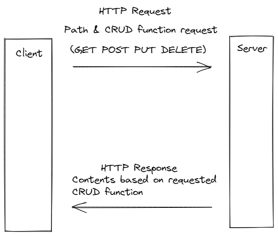
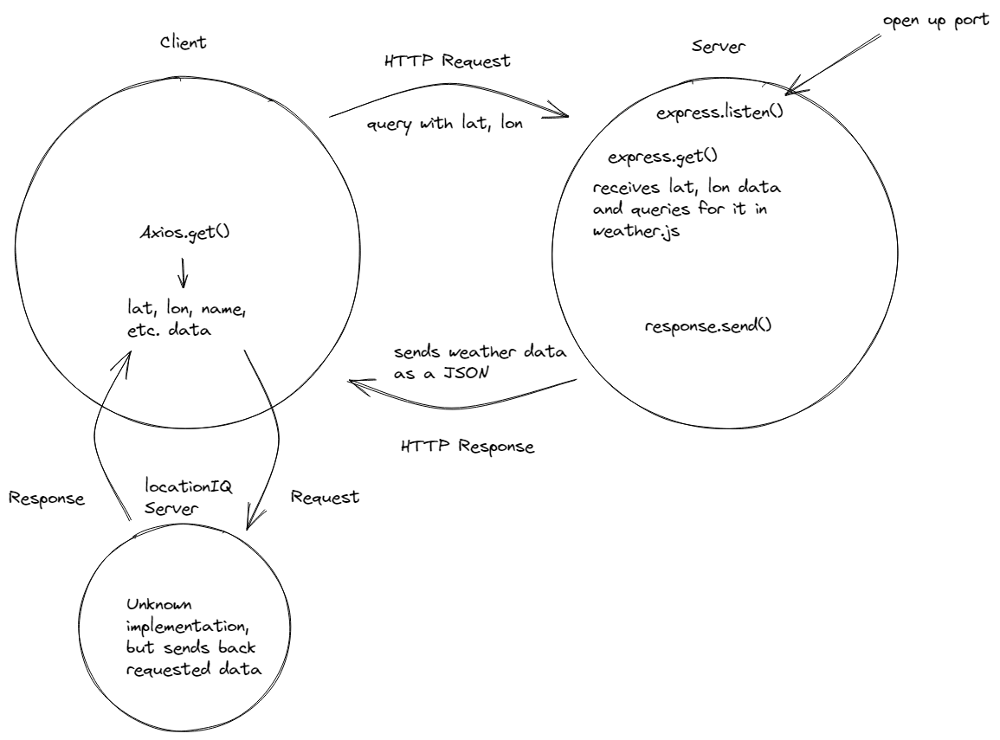

# City Explorer API

**Author**: Julian Gallegos
**Version**: 1.0.0 (increment the patch/fix version number if you make more commits past your first submission)

## Overview

Back-end server for City Explorer front-end app. Provides weather data.

## Getting Started
<!-- What are the steps that a user must take in order to build this app on their own machine and get it running? -->

## Architecture
<!-- Provide a detailed description of the application design. What technologies (languages, libraries, etc) you're using, and any other relevant design information. -->

## Change Log
<!-- Use this area to document the iterative changes made to your application as each feature is successfully implemented. Use time stamps. Here's an example:

01-01-2001 4:59pm - Application now has a fully-functional express server, with a GET route for the location resource. -->

## Credit and Collaborations
<!-- Give credit (and a link) to other people or resources that helped you build this application. -->

## Time Sheets lab 7

### Feature 7-1

Name of feature: Set up Server Repository

Estimate of time needed to complete: 20 minutes

Start time: 12:30pm

Finish time: 12:50pm

Actual time needed to complete: 20 minutes

### Feature 7-2

Name of feature: Weather (placeholder)

Estimate of time needed to complete: 1 hour

Start time: 10:30pm

Finish time: 12:50am

Actual time needed to complete: 150 minutes

### Feature 7-3

Name of feature: Errors (revisited)

Estimate of time needed to complete: 5 minutes

Start time: 12:50am

Finish time: 12:55am

Actual time needed to complete: 5 minutes

## Time Sheets lab 8

### Feature 8-1

Name of feature: Weather (live)

Estimate of time needed to complete: 50 minutes

Start time: 4:15pm

Finish time: 5:30pm

Actual time needed to complete: 75 minutes

### Feature 8-2

Name of feature: Movies

Estimate of time needed to complete: 40 minutes

Start time: 6:00pm

Finish time: 7:10pm

Actual time needed to complete: 70 minutes

### Feature 8-3

Name of feature: Publish

Estimate of time needed to complete: 30 minutes

Start time:  7:10pm

Finish time: 8:00

Actual time needed to complete: 50 minutes

## Time Sheets lab 9

### Feature 9-1

Name of feature: Refactor Back-End

Estimate of time needed to complete: 20 minutes

Start time: 11:20am

Finish time: 7:00pm

Actual time needed to complete: 10 minutes

### Feature 9-2

Name of feature: Refactor Front-End

Estimate of time needed to complete: 30 minutes

Start time: 11:30am

Finish time: 12:00pm

Actual time needed to complete: 30 minutes

## Time Sheets lab 10

### Feature 10-1

Name of feature: Performance

Estimate of time needed to complete: 35 minutes

Start time: 3:40pm

Finish time: 4:13pm

Actual time needed to complete: 33 minutes
